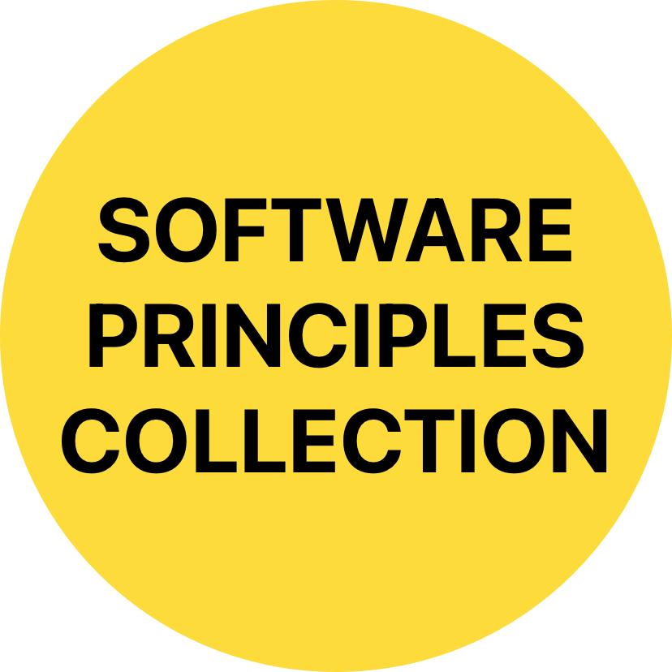

<!-- Begin README -->

    

 

    
    
    
     
    

---------------

<h1 align="center">Software Principles Series</h1>

    

A growing curated collection of foundational software principles, featuring links to repositories that delve into key concepts like OOP, SOLID, and more.

---------------

## Table of Contents

- [Software Principles](#software-principles)
- [License](#license)
- [Credits](#credits)

## Software Principles

Click on the repository links below to find out more information for each principle.

1. [SOLID Principles](https://github.com/Night-Owl-Labs/SOLID-Principles)
2. [OOP Principles](https://github.com/Night-Owl-Labs/OOP-Principles)
3. [Software "-ilities"](https://github.com/Night-Owl-Labs/Software-ilities)

## License

This project is released under the terms of the **MIT License**, which permits use, modification, and distribution of the code, subject to the conditions outlined in the license.
- The [MIT License](https://choosealicense.com/licenses/mit/) provides certain freedoms while preserving rights of attribution to the original creators.
- For more details, see the [LICENSE](LICENSE) file in this repository. in this repository.

## Credits

**Author:** [Night Owl Labs, LLC.](https://github.com/Night-Owl-Labs)  
**Email:** [support@nightowllabs.io](mailto:support@nightowllabs.io)  
**Website:** [nightowllabs.io](https://www.nightowllabs.io)  
**Reference:** [Main Branch](https://github.com/Night-Owl-Labs/Software-ilities)  

---------------

    

<!-- End README -->

